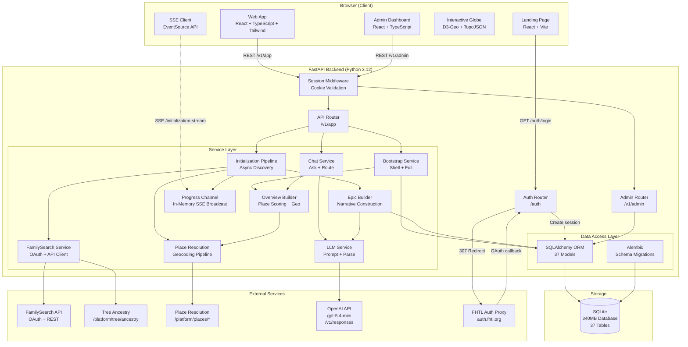
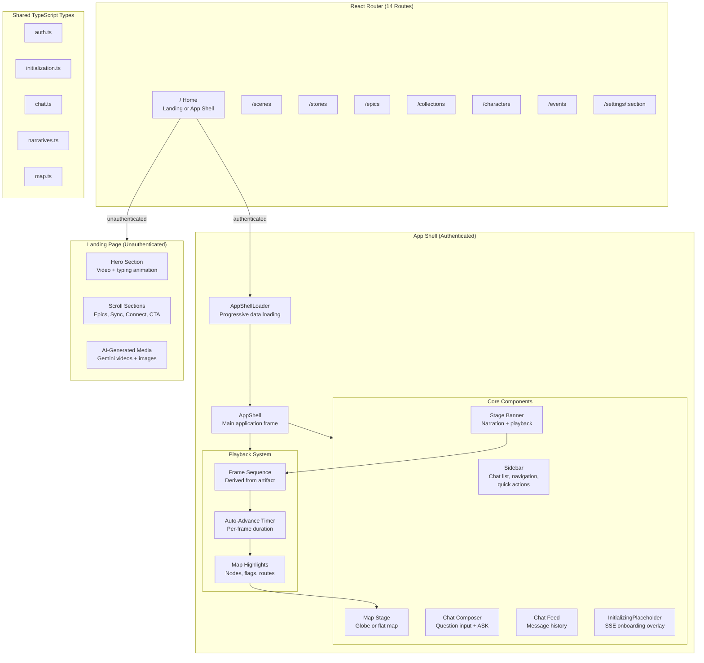

# Kinarrative — System Design
To be viewed using the Mermaid VSCode extension

## High-Level Architecture

---

## Data Pipeline Architecture

```mermaid
graph LR
    subgraph Stage1["Stage 1: Discovery (under 30s)"]
        LOGIN["User Logs In"] --> LAUNCH["Launch Pipeline<br/>(async)"]
        LAUNCH --> FETCH["Fetch 8 Generations<br/>FamilySearch API"]
        FETCH --> PARSE["Parse Persons<br/>~200 direct ancestors"]
        PARSE --> STREAM["Stream to Frontend<br/>SSE per generation"]
    end

    subgraph Stage2["Stage 2: BFS Expansion (background)"]
        BFS["Breadth-First Search<br/>Expand tree outward"]
        BFS --> SIBLINGS["Discover siblings,<br/>cousins, spouses"]
        SIBLINGS --> STORE_BFS["Store 16000<br/>UserTreePerson rows"]
    end

    subgraph Stage3["Stage 3: Detail Fetch (background)"]
        DETAIL["Fetch Full Records<br/>per person"]
        DETAIL --> FACTS["Extract Facts<br/>Birth, Death, Marriage,<br/>Residence, Census"]
        FACTS --> SOURCES["Extract Sources<br/>& Memories"]
    end

    subgraph Stage4["Stage 4: Place Resolution (background)"]
        PLACES["Resolve All Places"]
        PLACES --> FS_PD["FamilySearch<br/>Place Description API"]
        FS_PD --> FS_PS["FamilySearch<br/>Place Search API"]
        FS_PS --> NOM["Nominatim<br/>Geocoding Fallback"]
        NOM --> CACHE["Cache in<br/>CanonicalPlace table<br/>18000 places"]
    end

    subgraph Stage5["Stage 5: Epic Build"]
        EPIC["Build Epic"]
        EPIC --> ALGO["Algorithmic Analysis<br/>Key places, migrations,<br/>events per generation"]
        ALGO --> NARR["LLM Narrative<br/>Generation"]
        NARR --> STORE_EPIC["Store EpicRecord<br/>+ overview_json cache"]
    end

    STREAM --> BFS
    STORE_BFS --> DETAIL
    DETAIL --> PLACES
    PLACES --> EPIC
```

---

## Frontend Architecture

---

## Database Schema Groups

```mermaid
graph TB
    subgraph UserAuth["User & Auth (6 tables)"]
        U["users"]
        URA["user_role_assignments"]
        AS["auth_sessions"]
        ASR["auth_state_records"]
        EIL["external_identity_links"]
        FSC["familysearch_credentials"]
    end

    subgraph FSData["FamilySearch Cache (8 tables)"]
        FSP["fs_persons"]
        FSPF["fs_person_facts"]
        FSPN["fs_person_names"]
        FSPS["fs_person_sources"]
        FSPM["fs_person_memories"]
        FSPCG["fs_parent_child_groups"]
        FSCR["fs_couple_relationships"]
        FSCF["fs_couple_facts"]
    end

    subgraph Geo["Places & Events (2 tables)"]
        CP["canonical_places"]
        IED["important_event_definitions"]
    end

    subgraph Tree["User Tree (1 table)"]
        UTP["user_tree_persons"]
    end

    subgraph Chat["Chat & Conversation (3 tables)"]
        C["chats"]
        CM["chat_messages"]
        RB["response_bundles"]
    end

    subgraph Artifacts["Narrative Artifacts (3 tables)"]
        SR["scene_records"]
        STR["story_records"]
        ER["epic_records"]
    end

    subgraph Collections["Collections (4 tables)"]
        SA["saved_artifacts"]
        SC["saved_collections"]
        CE["collection_entries"]
        CEI["collection_entry_items"]
    end

    subgraph Prefs["User Preferences (7 tables)"]
        UP["user_profiles"]
        US["user_settings"]
        UC["user_consents"]
        UCH["user_consent_history"]
        UM["user_memory"]
        UFP["user_favorite_people"]
        SF["scene_feedback"]
    end

    subgraph Analytics["View State & Analytics (3 tables)"]
        VSS["view_state_snapshots"]
        AE["analytics_events"]
        AAL["admin_audit_logs"]
    end

    %% Key relationships
    U --> URA
    U --> AS
    U --> EIL
    EIL --> FSC
    U --> UTP
    UTP --> FSP
    FSP --> FSPF
    FSP --> FSPN
    FSP --> FSPCG
    FSPF --> CP
    U --> C
    C --> CM
    CM --> RB
    RB --> SR
    RB --> STR
    RB --> ER
    U --> SA
    U --> SC
    SC --> CE
    CE --> CEI
    U --> UP
    U --> US
    U --> AE
```

---

## Tech Stack Summary

| Layer | Technology | Purpose |
|-------|-----------|---------|
| **Frontend** | React 19, TypeScript 6, Vite 6.3 | UI framework and build tool |
| **Styling** | Tailwind CSS 4 | Utility-first CSS |
| **Visualization** | D3-Geo, TopoJSON, world-atlas | Interactive globe and map rendering |
| **Routing** | React Router DOM 7 | Client-side navigation (14 routes) |
| **Backend** | Python 3.12, FastAPI, Uvicorn | API server |
| **ORM** | SQLAlchemy 2.0, Alembic | Database models and migrations |
| **Database** | SQLite | Local relational storage (37 tables) |
| **Task Queue** | Dramatiq + Redis | Background job processing |
| **AI** | OpenAI gpt-5.4-mini | Narrative generation (structured JSON) |
| **External API** | FamilySearch REST API | Ancestry data, place resolution |
| **Auth** | FHTL Auth Proxy → FamilySearch OAuth | Authentication and session management |
| **Real-time** | Server-Sent Events (SSE) | Onboarding progress streaming |
| **Media** | Google Gemini | AI-generated video/image assets |
| **Monorepo** | npm workspaces | Shared types across apps |
